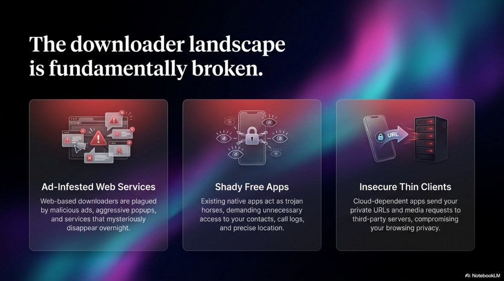
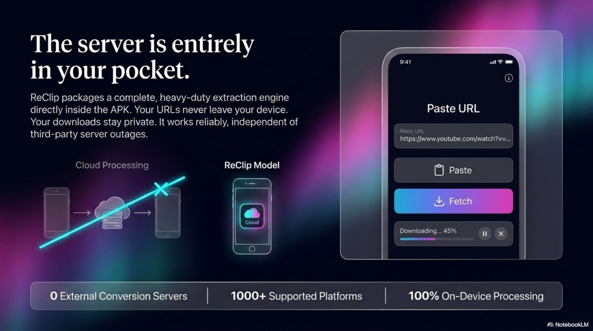
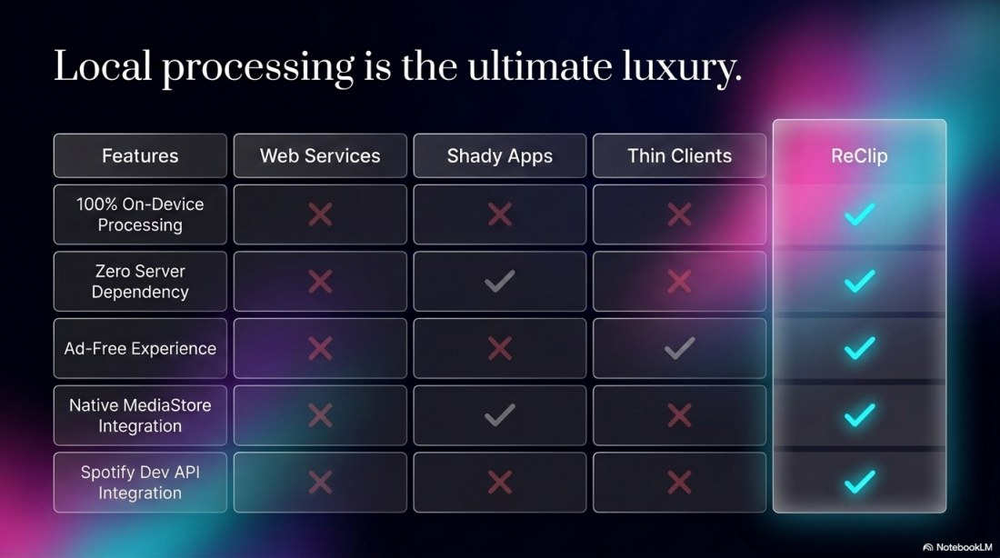
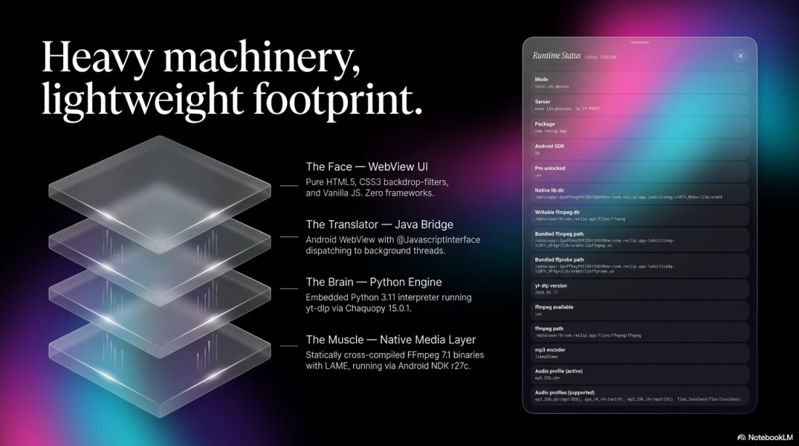
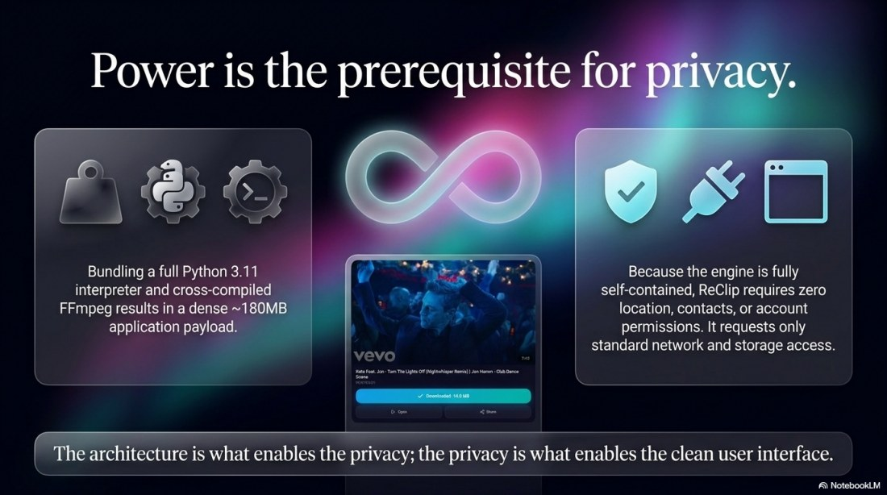
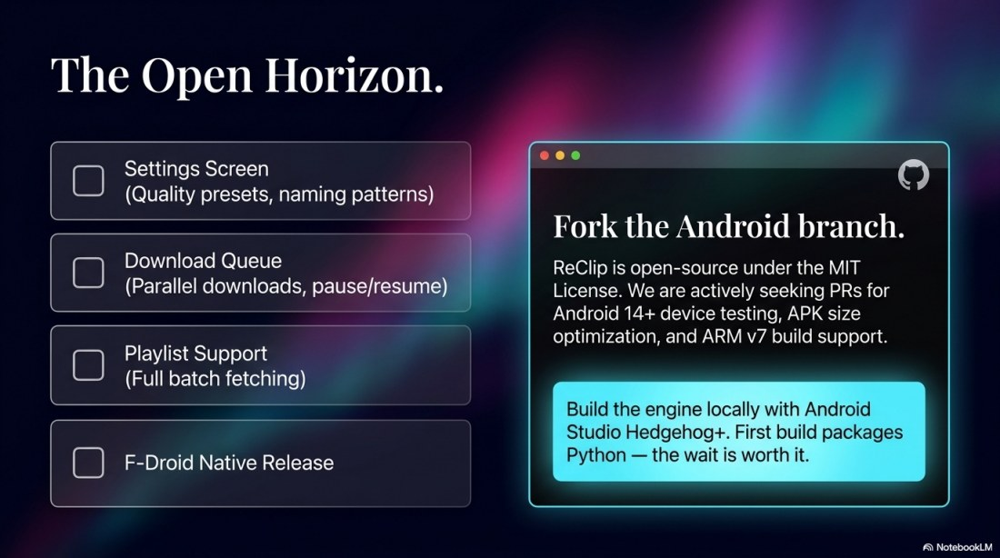

# ReClip Serverless Media Engine

This README is generated from `docs/readme/ReClip_Serverless_Media_Engine.pdf`. To refresh it, run:

```powershell
py -3 -m pip install pypdfium2 pillow
py -3 scripts/update_readme_images.py
```

<p align="center"></p>
<p align="center"></p>
<p align="center"></p>
<p align="center"></p>
<p align="center"></p>
<p align="center"></p>
<p align="center"></p>
<p align="center"></p>
<p align="center"></p>
